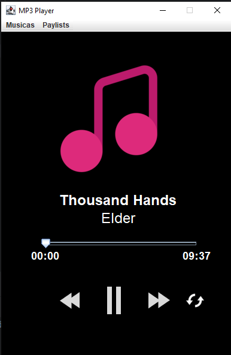
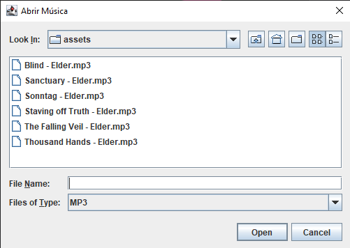
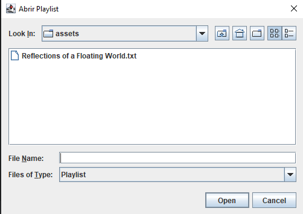

# MP3 Player

Um tocador de música simples, implementado em Java Swing, com suporte para reprodução de arquivos MP3, controle de playlists e demais interações.

## Índice
- <a href="#funcionalidades">Funcionalidades do Projeto</a>
- <a href="#tecnologias-utilizadas">Tecnologias utilizadas</a>
- <a href="#estrutura-do-projeto">Estrutura do Projeto</a>
- <a href="#como-usar">Como Usar</a>
- <a href="#requisitos-do-sistema">Requisitos</a>
- <a href="#screenshots">Screenshots</a>
- <a href="#personalização">Personalização</a>

## Funcionalidades
- **Reprodução de  Músicas .mp3**
- **Controle de Play/Pause**
- **Slider de Progresso**
- **Loop**
- **Criação de Playlists**

## Tecnologias Utilizadas
- **Java Swing** para construção da interface gráfica.
- **JLayer** (javazoom.jl.player.advanced) para reprodução de arquivos MP3.
- **Mp3Magic** - Usada para ler e manipular tags ID3 de arquivos MP3.

## Estrutura do Projeto
- **Main Class**: MP3Player: Ponto de entrada do programa, inicializa a interface gráfica.
- **interfaces**: Contém a interface gráfica do tocador, `JanelaTocadorDeMusica`, com componentes de controle e exibição e `PlaylistDialog`, Diálogo para adicionar e salvar playlists, permitindo que o usuário selecione músicas e armazene os caminhos em um arquivo .txt.
- **controle**: Implementa o `TocadorDeMusica`, responsável pelo controle de reprodução, incluindo carregamento de músicas, manipulação de playlists e eventos de reprodução.
- **entidade**: Contém a classe `Musica`, que representa os arquivos MP3 e armazena metadados como título, artista e duração.

## Como Usar
1. Carregar Música: Vá ao menu "Músicas" e selecione "Carregar Música". No explorador, clique em uma música e aperte em "Open".
2. Criar Playlist: Vá ao menu "Playlists" e selecione "Criar Playlist". Em seguida, selecione "Adicionar" e selecione uma música. Repita até preencher sua playlist, selecione "salvar" e digite um nome para a playlist. 
3. Reprodução: Use os botões de controle (Play, Pause, Anterior, Próxima) para navegar pelas músicas.

## Requisitos do Sistema

    Java JDK 8 ou superior
    Biblioteca JLayer para reprodução de MP3, disponível em https://github.com/umjammer/jlayer.

## Screenshots

## Personalização
    As cores do fundo e do texto podem ser alteradas através das variáveis TEXT_COLOR e FRAME_COLOR na classe JanelaTocadorDeMusica.

## Contribuição

Contribuições são bem-vindas!